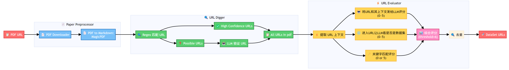
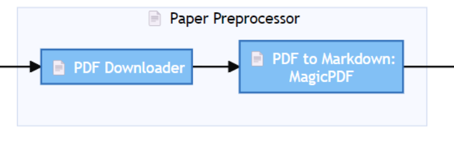
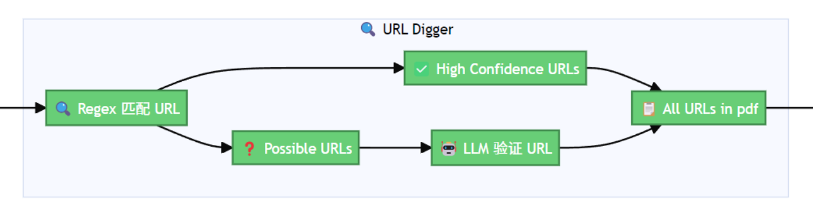
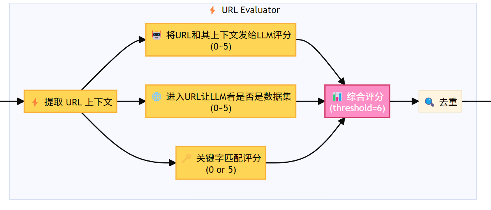
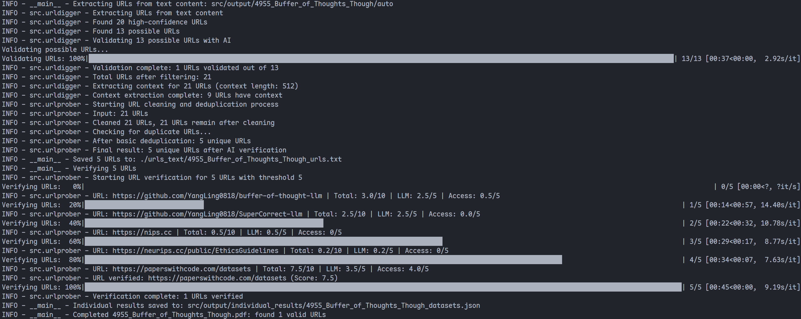

# DataSet URL Finder

## 项目概述

- **目标**：从学术论文PDF中自动识别和提取数据集相关的URL。
- **核心技术**：
  - PDF处理与文本提取
  - 正则表达式 + 大语言模型提取URL
  - 三维评分机制，确定一个URL是否确为数据集URL

## 系统架构

下图为我们设计的整个系统的架构图：


项目从逻辑上拆分成了Paper Preprocessor, URL Digger和URL Evaluator三个部分。各部分的作用如下文所述。

## Paper Preprocessor

### 核心目标

完成PDF下载任务和文字提取任务。

对应代码中的src/pdfurl2md.py。

### 架构图

下图为Paper Preprocessor的子架构图：


### 技术实现

- **PDF下载**：直接使用requests库逐字节地下载pdf即可。
- **文字提取**：使用magic-pdf转换PDF→Markdown

我们使用magic-pdf的原因是其使用高准确率视觉模型识别pdf，精度高，利于我们后续在此基础上提取所有URL并相应评测出数据集URL。

### 存在问题

#### 跨行URL处理问题

magic-pdf转换时，跨行的URL可能在换行处插入额外空格，影响URL完整性识别。

在聆听了其他小组的汇报后，知悉了可以通过直接提取pdf的href属性而定位链接，然而我们从实践上发现一些没有标注协议头（https://, http://）的缩略版URL缺少了href属性，因而这一方法并不通用，目前暂无特别优质的方法解决这一问题。

可能的解决思路有：
- 后续通过智能匹配算法处理
- 大模型验证机制补偿

## URL Digger

### 核心目标

从PDF文字中提取所有的URL，不管是不是数据集URL。

对应代码中的src/urldigger.py。

### 架构图

下图为URL Digger的子架构图：


### 双重匹配策略

URL Digger的处理流程分为四步，核心为双重匹配策略：

1. 正则表达式扫描全文
2. 分类：高置信度 vs 可能URL
3. LLM验证可能URL的正确性
4. 高置信度URL与正确的可能URL合并生成完整URL列表

其中第二步需要详细说明：应对有https://， http://头和没有该协议头的URL，我们设计了两套正则表达式分别匹配：

```python
high_confidence_pattern = r'(https?:\/\/(?:www\.|(?!www))[a-zA-Z0-9][a-zA-Z0-9-]+[a-zA-Z0-9]\.[^\s]{2,}|www\.[a-zA-Z0-9][a-zA-Z0-9-]+[a-zA-Z0-9]\.[^\s]{2,}|https?:\/\/(?:www\.|(?!www))[a-zA-Z0-9]+\.[^\s]{2,}|www\.[a-zA-Z0-9]+\.[^\s]{2,})'
possible_url_pattern = r'([a-zA-Z0-9][a-zA-Z0-9-]+[a-zA-Z0-9]\.[a-zA-Z0-9][a-zA-Z0-9-]+[a-zA-Z0-9]\.[^\s]{2,}|[a-zA-Z0-9][a-zA-Z0-9-]+[a-zA-Z0-9]\.[^\s]{2,})'
```

在可能的URL被匹配出来后，我们做了一些简单的基于规则的筛选，然后将剩下不确定的给AI让其判断到底是不是合法的URL链接并让AI做一些可能的修正。最后与高置信度URL合并成为论文中所有的URL列表。

## URL Evaluator

### 核心目标

通过三重评分机制，从论文提取出的所有URL中筛选出真正的数据集URL。

对应代码中的src/urlprober.py。

### 架构图

下图为URL Evaluator的子架构图：


### 三重评分机制

三重评分机制的详细说明如下：

#### 上下文分析

**LLM评分 (0-5分)**

- 分析URL周围文本
- 让大模型判断与数据集的相关性

相应的AI prompt如下：

```python
prompt = f"""
Given the following URL and its context from an academic paper:
URL: {url}
Context: {context}

Please determine from the context if this URL provides access to actual dataset files or data repositories that can be downloaded or accessed.

Consider these criteria and platform-specific guidelines: (The higher the score, the more likely it is to provide datasets. Don't hesitate to rank very high if the context suggests it is a dataset link, and don't hesitate to rank very low if it obviously is not a dataset link.)

1. DATASET REPOSITORIES (Score 1.0-5.0):
- HuggingFace datasets: https://huggingface.co/datasets/...
- Kaggle datasets: https://kaggle.com/datasets/...
- UCI ML Repository: https://archive.ics.uci.edu/ml/datasets/...
- Zenodo data repositories: https://zenodo.org/record/... (with data files)
- Direct download links: ending with .zip, .tar.gz, .csv, .json, .parquet for datasets
- Government/academic data portals with actual dataset downloads

2. CODE REPOSITORIES WITH DATASETS (Score 1.0-5.0):
- GitHub repositories that specifically host datasets in their repo (data/ folder, dataset files), and that they host datasets can be extrapolated from the context

3. RESEARCH/DOCUMENTATION PLATFORMS/PUBLISHER/JOURNAL WEBSITES (Score 0.0-1.0):
- ArXiv papers: https://arxiv.org/...
- Research project homepages without direct data access
- Papers With Code project listings (unless direct dataset link)
- General documentation or tutorial websites
- Social media or blog posts
- Journal article pages (Nature, IEEE, ACM, etc.)
- Publisher websites without dataset access
- Paywalled content without data downloads

4. UNCERTAIN/INACCESSIBLE (Score 0.0-3.0):
- URLs returning 404/403 but context suggests they were dataset links
- Ambiguous URLs where purpose cannot be clearly determined
- Private/restricted access sites where dataset nature is unclear

IMPORTANT: 
- GitHub repositories should score higher if they clearly host datasets, not just code
- Consider the context: if paper mentions "we used dataset X from GitHub repo Y", it might be legitimate
- Zenodo and institutional repositories should generally score high if they contain data
- Focus on whether DATA is accessible, not just whether it's a "proper" dataset platform

Rate this URL from 0 to 5 (decimal scores encouraged), and provide a brief explanation.

Respond in the following format:
Score: [decimal number between 0-5]
Explanation: [your explanation]
"""
```

#### 网站内容分析  

**BeautifulSoup + LLM (0-5分)**

- 访问实际网站
- 让大模型分析页面内容
- 确认是否为数据集

相应的AI prompt如下：

```python
prompt = f"""
You are an expert in identifying dataset websites. Please analyze the following webpage content and determine if this website provides access to datasets or data repositories.

URL: {url}
Page Title: {page_title}
Number of potential data file download links: {download_links}
Data-related keywords found: {data_keywords}

Page Content (first 3000 characters):
{page_text}

Please evaluate this webpage based on the following criteria: (The more likely it is to provide datasets, the higher the score)
- Does the page provide direct access to downloadable datasets?
- Are there clear instructions or links to access datasets?
- Is the content focused on datasets or data repositories?
- Is the page from a reputable dataset platform or repository?
- Does the page have clear documentation or metadata about the datasets?

Please rate this webpage on a scale from 0.0 to 5.0 based on its usefulness for obtaining datasets, using the following scoring system:

DATASET REPOSITORIES (Score 2.5-5.0):
- Dedicated dataset platforms (HuggingFace, Kaggle, UCI ML Repository, etc.)
- Government/academic data portals with downloadable datasets
- Research data repositories (Zenodo, Figshare) with actual data files
- Pages with direct download links for data files (.csv, .json, .zip, etc.)
- Dataset documentation with clear access instructions
- Database dumps or API endpoints for data access

CODE REPOSITORIES WITH DATA (Score 2.5-5.0):
- GitHub/GitLab repositories specifically hosting datasets
- Research projects with data folders and dataset files
- Open source projects primarily for data sharing
- Repositories with dataset releases or data downloads

NON-DATASET CONTENT (Score 0.0):
- General software repositories without data focus
- Commercial websites with limited data offerings
- Blog posts or news articles mentioning datasets
- Social media or forum discussions about data
- Educational content not specifically about datasets
- Completely unrelated content (entertainment, personal blogs, etc.)
- Error pages or broken websites
- Paywalled content without clear data access
- General business websites
- Spam or malicious content

EVALUATION GUIDELINES:
1. Focus on whether actual data/datasets can be obtained from this page
2. Higher scores for direct download capabilities
3. Consider the quality and relevance of the dataset content
4. Academic and research contexts should be weighted positively
5. Clear documentation and accessibility increase the score
6. Multiple data formats or large datasets indicate higher value

Rate this webpage from 0.0 to 5.0 and provide a brief explanation focusing on what makes this page useful (or not useful) for obtaining datasets.

Respond in exactly this format:
Score: [number between 0.0-5.0]
Explanation: [your reasoning in 1-2 concise sentences]
"""
```

#### 关键词匹配

**规则评分 (0分或5分)**

- dataset, kaggle, data等关键词匹配
- github.com/datasets
- 其他数据集平台标识

#### 最终决策

阈值设定：将所有分数相加，总分 >= 5分 -> 判定为数据集URL。（在实操上，下面的关键词匹配融合进了网站内容分析中，因而阈值只设为了5分）

在实践中，我们发现一些URL可能受Cloudflare保护无法登入，抑或就是已无法连接上。对于这些URL，它们的网站内容评分作废了，相应地，阈值也会降低一半。

### 去重

提取出的数据集URL可能有重复,如:

```
https://www.robots.ox.ac.uk/~vgg/data/fgvc-aircraft/
www.robots.ox.ac.uk/~vgg/data/fgvc-aircraft/
```

#### 解决方案

我们设计的算法如下：

1. 设定一个相似度阈值(实操中设为了0.8)，对每两个url做检验，如果两个url最长相同子串长度占比超过这个阈值就记录下来
2. 记录下来的url对让ai看看是不是真重复了
3. 如果真重复了就删掉其中任意一个

另外一个较明显的思路是进入两个URL分别的网页比较相不相同，但这样的方法是有局限性的：比如两个URL分别指向了同一个项目的首页和代码页面，这也算重复，但是这种方法就判断不出来。

因此，我们自行设计了这样一个能更好地保证正确率的算法。

## 成果展示

### 代码的其他实现细节

我们使用了logging库代替print已更美观地使程序输出。同时，实施了完备的checkpoint机制，使得程序无论跑到哪里终止了，下一次都能从上次没跑完的地方开始接着跑。

### 运行示例截图

下图为处理一个pdf时的示例截图。由于我们之前已使用了magic-pdf将该pdf转文本，所以此处没有magic-pdf的输出：


### 提取结果示例

我们的架构从"Flipped Classroom: Aligning Teacher Attention with Student in Generalized Category Discovery"一文中提取出的结果:

```
https://www.cs.toronto.edu/~kriz/cifar.html
https://www.kaggle.com/c/imagenet-object-localization-challenge/overview/
https://www.image-net.org/download.php
https://www.vision.caltech.edu/datasets/cub_200_2011/
https://www.kaggle.com/datasets/jessicali9530/stanford-cars-dataset
https://www.robots.ox.ac.uk/~vgg/data/fgvc-aircraft/
www.kaggle.com/datasets/jessicali9530/stanford-cars-dataset
www.cs.toronto.edu/~kriz/cifar.html
```

经验证, 基本符合人工寻找数据集的结果。

#### 最终运行时的一些问题

在运行提供的五十篇论文时，我们发现有两个URL难以判定到底算不算数据集URL：

```
https://huggingface.co/datasets
https://paperswithcode.com/datasets
```

它们没有提供具体的数据集，但确实是大批数据集的索引。因此我们最终还是判定这两个URL属于我们想要的结果。

此外，有一些链接指向了某个项目的主页，然后在这个项目内部的某个子目录下有数据集。对于这样的链接，我们也认为其符合要求。

## 代码的运行

#### 准备工作

在src/apikey.txt中直接放入openai apikey，在代码根目录下放入“课程作业论文”文件夹。

此外，使用./install.sh安装好环境：

```sh
./install.sh
```

#### 实际运行

使用项目根目录下的`run.py`即可一键跑通：

```sh
python run.py
```

## 总结

### 🔍 三大部分

- **Paper Preprocessor:** 尽可能准确地将pdf转文本
- **URL Digger:** 混合匹配策略, 正则+AI双重保障
- **URL Evaluator:** 三维评分机制+去重, 得到真正的数据集URL

### 🚀 未来展望

- 使用更好的大模型进一步增加准确性
- 支持更多文档格式（Word、LaTeX等）
- 优化LLM调用策略，降低成本
- 优化算法，提升整体处理效率
