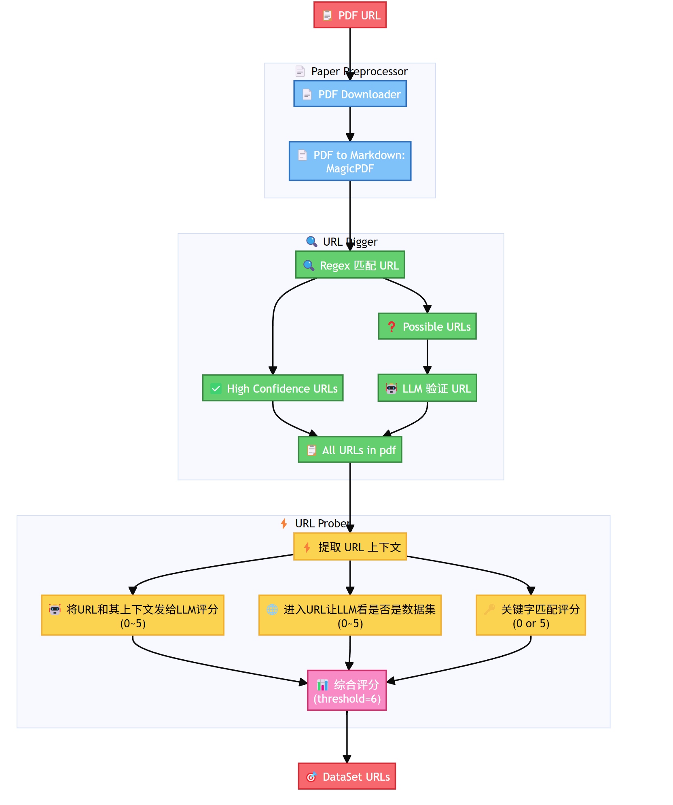

# Dataset-URL-Finder 技术报告

## 架构

## Paper Preprocesser

**目标: 完成pdf下载任务和提取文字任务。**

- 使用requests库下载pdf文件
- 使用magic-pdf将pdf转换成md,完成提取文字的工作(慢但准)

存在的问题: magic-pdf转换成的文字可能会在一些地方多出空格(如,如果一个url跨行,则跨行处可能多出空格)

## URL Digger

**目标: 从pdf的文字中提取可能的数据集URL。**

直觉上当然使用正则表达式匹配URL。

然而考虑到一些url可能像是`baidu.com`这种缺少开头的http://或www.的格式,因此用了两个正则表达式分别匹配肯定是URL的字符串和可能是URL的字符串。

提取出的可能是URL的字符串经由大模型判断到底是不是一个合法的URL。完成初筛。

最后将二者合并获取完整的论文提及的URL列表。

## URL Evaluator

**目标: 使用多种方法一同判断URL Digger提取出的URL中到底哪些是合法的数据集URL。**

一共使用了三种评分方法:

1. 将URL和其上下文发给LLM评分(0~5分)
2. 用BeautifulSoup进入URL让LLM看是否是数据集(0~5分)
3. 如果URL中有某些关键字,直接加5分(eg. dataset, kaggle, ...)

最终将总分的threshold设为了6: 所有高于6分的URL都被认为是合法的数据集URL, 输出为结果。

