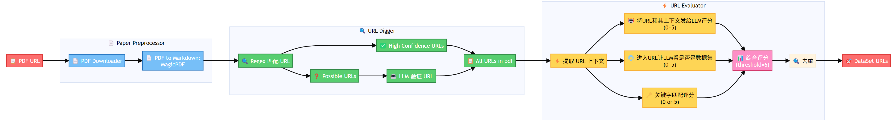
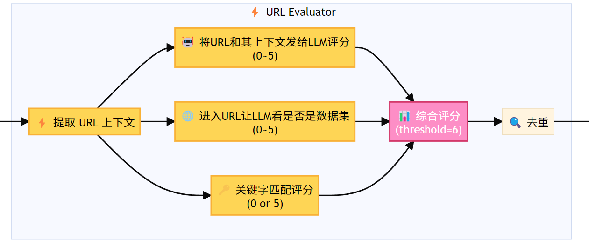

# Dataset URL Finder

###### 从学术论文中自动提取数据集URL

<!-- _class: cover_e -->
<!-- _header: "" --> 
<!-- _footer: "" --> 
<!-- _paginate: "" --> 


王思宇 薛佳音 王镜凯
2025.5.26

## 目录

<!-- _class: cols2_ol_ci fglass toc_a  -->
<!-- _footer: "" --> 
<!-- _header: "目录" --> 
<!-- _paginate: "" -->

- [项目概述](#3)
- [系统架构](#5) 
- [Paper Preprocessor](#7)
- [URL Digger](#9)
- [URL Evaluator](#11)
- [技术挑战与解决方案](#13)
- [总结](#15)

## 项目概述

<!-- _class: trans -->
<!-- _footer: "" -->
<!-- _paginate: "" -->

## 项目概述

<!-- _class: fixedtitleA -->

- **目标**：从学术论文PDF中自动识别和提取数据集相关的URL
- **核心技术**：

  - PDF处理与文本提取
  - 正则表达式 + 大语言模型提取URL
  - 多维度评分机制

## 系统架构

<!-- _class: trans -->
<!-- _footer: "" -->
<!-- _paginate: "" -->

## 系统架构


&nbsp;&nbsp;&nbsp;&nbsp;&nbsp;&nbsp;&nbsp;&nbsp;&nbsp;&nbsp;&nbsp;&nbsp;**文档预处理** &nbsp;&nbsp;&nbsp; &nbsp;&nbsp;-->&nbsp;&nbsp;&nbsp;&nbsp;&nbsp;&nbsp;&nbsp;&nbsp;&nbsp;&nbsp;&nbsp;**链接智能提取** &nbsp;&nbsp;&nbsp;&nbsp;&nbsp;&nbsp;&nbsp;&nbsp;&nbsp;-->&nbsp;&nbsp;&nbsp;&nbsp;&nbsp;&nbsp;&nbsp;&nbsp;&nbsp;&nbsp;&nbsp;&nbsp;&nbsp;&nbsp;**评分验证**

## Paper Preprocessor

<!-- _class: trans -->
<!-- _footer: "" -->
<!-- _paginate: "" -->

## Paper Preprocessor

<!-- _class: cols-2 -->

<div class=ldiv>

#### 🎯 核心目标
完成PDF下载任务和文字提取任务

#### 🔧 技术实现
- **PDF下载**：使用requests库
- **文字提取**：使用magic-pdf转换PDF→Markdown

</div>

<div class=rdiv>


</div>

### ⚠️ 存在挑战

<!-- _class: bq-red -->

> **跨行URL处理问题**
> 
> magic-pdf转换时，跨行的URL可能在换行处插入额外空格，影响URL完整性识别

#### 💡 解决思路
- 后续通过智能匹配算法处理
- 大模型验证机制补偿


## URL Digger

<!-- _class: trans -->
<!-- _footer: "" -->
<!-- _paginate: "" -->

## URL Digger

<!-- _class: fixedtitleA -->
<!-- _class: cols-2-64 -->

<div class=ldiv>

#### 🎯 核心目标

从PDF文字中提取可能的数据集URL

#### 处理流程

1. 正则表达式扫描全文
2. 分类：高置信度 vs 可能URL
3. LLM验证可能URL
4. 合并生成完整URL列表


</div>

<div class=rdiv>

#### 🔍 双重匹配策略

#### 高置信度URL匹配
- **完整格式**：`http://`, `https://`, `www.`
- **正则表达式**：标准URL格式识别
- **直接通过**：无需二次验证

#### 可能URL匹配  
- **简化格式**：`baidu.com`, `github.io`
- **正则表达式**：域名格式识别,可能有假阳性, eg. `Fig.4b`
- **LLM验证**：大模型判断合法性


</div>

## URL Evaluator

<!-- _class: trans -->
<!-- _footer: "" -->
<!-- _paginate: "" -->

## URL Evaluator: 三重评分判定真正的数据集URL

<!-- _class: fixedtitleA -->
<!-- _class: cols-3 -->

<div class=ldiv>

#### 🤖 上下文分析
**LLM评分 (0-5分)**
- 分析URL周围文本
- 判断与数据集的相关性
- 考虑学术语境

</div>

<div class=mdiv>

#### 🌐 网站内容分析  
**BeautifulSoup + LLM (0-5分)**
- 访问实际网站
- 分析页面内容
- 确认是否为数据集

</div>

<div class=rdiv>

#### 🔑 关键词匹配
**规则评分 (0分或5分)**
- dataset, kaggle, data
- github.com/datasets
- 其他数据集平台标识

</div>

## URL Evaluator

#### 🎯 最终决策
**阈值设定**：总分 ≥ 6分 → 判定为数据集URL



## 去重

提取出的数据集URL可能有重复,如:

```
https://www.robots.ox.ac.uk/~vgg/data/fgvc-aircraft/
www.robots.ox.ac.uk/~vgg/data/fgvc-aircraft/
```

>**解决方案**
> 1.设定一个相似度阈值，对每两个url做检验，如果两个url最长相同子串长度占比超过这个阈值就记录下来
> 2.记录下来的url对让ai看看是不是真重复了
> 3.如果真重复了就删掉其中任意一个


## 成果展示

<!-- class: fixedtitleA -->
<!-- class: cols-2-64 -->

<div class="ldiv">

我们的架构从右边这篇论文提取出的结果:

```
https://www.cs.toronto.edu/~kriz/cifar.html
https://www.kaggle.com/c/imagenet-object-localization-challenge/overview/
https://www.image-net.org/download.php
https://www.vision.caltech.edu/datasets/cub_200_2011/
https://www.kaggle.com/datasets/jessicali9530/stanford-cars-dataset
https://www.robots.ox.ac.uk/~vgg/data/fgvc-aircraft/
www.kaggle.com/datasets/jessicali9530/stanford-cars-dataset
www.cs.toronto.edu/~kriz/cifar.html
```

经验证, 基本符合人工寻找数据集的结果。

</div>

<div class="rdiv">


</div>


## 总结

<!-- _class: trans -->
<!-- _footer: "" -->
<!-- _paginate: "" -->

## 总结

<!-- _class: bq-blue -->

#### 🔍 三大部分

- **Paper Preprocessor:** 尽可能准确地将pdf转文本
- **URL Digger:** 混合匹配策略, 正则+AI双重保障
- **URL Evaluator:** 三维评分机制+去重, 得到真正的数据集URL

#### 🚀 未来展望

- 使用更好的大模型进一步增加准确性
- 支持更多文档格式（Word、LaTeX等）
- 优化LLM调用策略，降低成本

---

<!-- _class: lastpage -->
<!-- _footer: "" -->

###### 感谢聆听！

<div class="icons">
- <i class="fa-solid fa-envelope"></i>
  <!-- - 技术交流：dataset-finder@example.com -->
- <i class="fa-brands fa-github"></i> 
  <!-- - 项目地址：github.com/dataset-url-finder -->
- <i class="fa-solid fa-house"></i> 
  <!-- - 更多资源：dataset-tools.org -->
<div>

